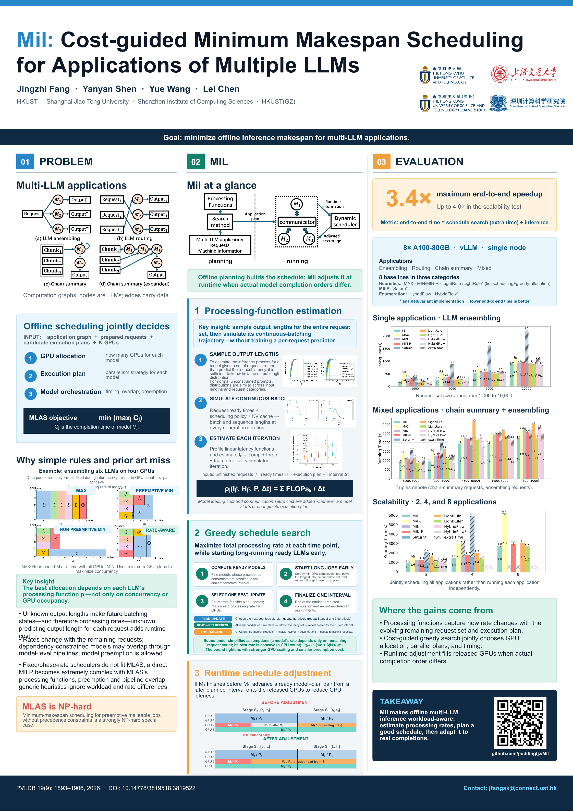

# Mil

Official implementation of **Mil: Cost-guided Minimum Makespan Scheduling for Applications of Multiple LLMs**. Mil is built on top of [vLLM](https://github.com/vllm-project/vllm).

  <a href="./technical_report/technical_report.pdf">Paper</a>
  &nbsp;·&nbsp;
  <a href="https://doi.org/10.14778/3819518.3819522">DOI</a>
  &nbsp;·&nbsp;
  <a href="./assets/poster/Mil_VLDB_A1_Poster.pdf">Poster PDF</a>
  &nbsp;·&nbsp;
  <a href="./assets/poster/Mil_VLDB_A1_Poster.pptx">Editable poster</a>

## Poster

  

  Click the poster to open the full-resolution PDF. 
  <a href="./assets/poster/Mil_VLDB_A1_Poster.pdf">View PDF</a>
  &nbsp;·&nbsp;
  <a href="./assets/poster/Mil_VLDB_A1_Poster.pptx">Download editable PowerPoint</a>

## Installation

Install the version of vLLM included in this repository before running Mil.

## Repository structure

- [`benchmarks/`](./benchmarks/) contains the core implementation of Mil.
- [`benchmarks/MY_README.md`](./benchmarks/MY_README.md) describes the code structure.
- [`benchmarks/add_a_new_model.md`](./benchmarks/add_a_new_model.md) explains how to build the cost model for a new model.
- [`technical_report/technical_report.pdf`](./technical_report/technical_report.pdf) contains the technical report.

## Reproducing the paper's experiments

Use [`benchmarks/run_end2end_exp.sh`](./benchmarks/run_end2end_exp.sh) to run the end-to-end experiments reported in the paper.
